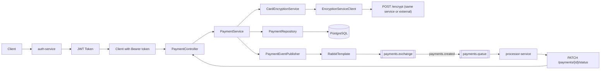
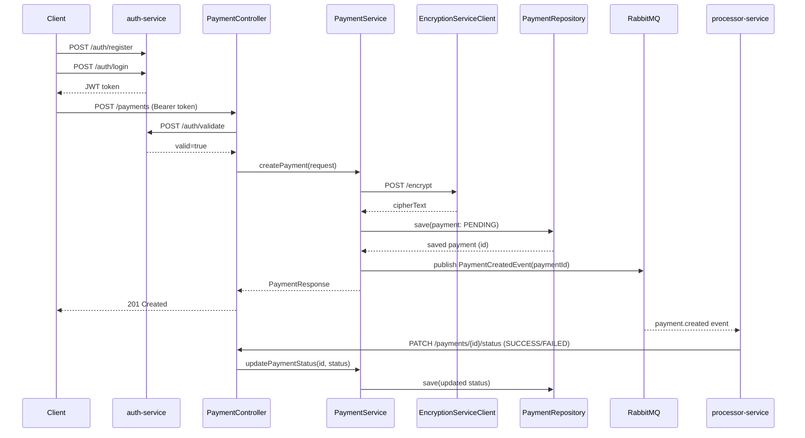

# Payment Service - Architecture & System Design

## Overview

`payment-service` is a Spring Boot service that:

- Works with `auth-service` for JWT-based user authentication.
- Creates and stores payments in PostgreSQL.
- Encrypts incoming card numbers before persistence.
- Publishes a `payment.created`-style event to RabbitMQ after payment creation.
- Exposes APIs to read a payment and update payment status.

The service follows a layered design:

- `controller` -> `service` -> `repository` -> `entity`

---

## High-Level Architecture

```text
Client (obtain JWT first)
  |
  v
auth-service (/auth/register, /auth/login, /auth/validate)
  |
  v
JWT token
  |
  v
Client with Bearer token
  |
  v
PaymentController (/payments)
  |
  v
PaymentService
  |---> CardEncryptionService -> EncryptionServiceClient -> POST /encrypt
  |                                              (base URL configurable)
  |
  |---> PaymentRepository (Spring Data JPA) -> PostgreSQL
  |
  '---> PaymentEventPublisher -> RabbitTemplate -> payments.exchange
                                                routing key: payments.created
                                                queue: payments.queue
```

### Architecture Diagram (Mermaid)



---

## Package Structure

```text
com.example.payment
  PaymentApplication
  paymet
    config/
    controller/
    dto/
    entity/
    exception/
    messaging/
    repository/
    service/
    util/
```

Note: the current package name is `paymet` (as implemented in code).

---

## Core Components

### 1) API Layer (`controller`)

- `PaymentController`
  - `POST /payments` - create a payment
  - `GET /payments/{id}` - fetch a payment
  - `PATCH /payments/{id}/status` - update payment status
- `EncryptionController`
  - `POST /encrypt`
  - `POST /decrypt`

### 2) Service Layer (`service`)

- `PaymentService`
  - Validates request payload.
  - Normalizes currency (uppercase, 3 letters).
  - Encrypts card number before saving.
  - Saves payment via JPA repository.
  - Publishes `PaymentCreatedEvent` after save.
- `CardEncryptionService`
  - Delegates to `EncryptionServiceClient` (HTTP call to `/encrypt`).
- `AesEncryptionService`
  - Local AES encrypt/decrypt logic for `/encrypt` and `/decrypt`.
- `EncryptionServiceClient`
  - Calls external (or same-service) encryption endpoint.
  - Maps remote failures to proper HTTP errors.

### 3) Persistence Layer (`repository`, `entity`)

- `PaymentRepository` extends `JpaRepository<Payment, UUID>`.
- `Payment` entity fields:
  - `id` (UUID)
  - `amount`
  - `currency`
  - `encryptedCardNumber`
  - `status` (`PENDING`, `SUCCESS`, `FAILED`)
  - `createdAt` (`@PrePersist` timestamp)

### 4) Messaging Layer (`config`, `messaging`)

- `RabbitMQTopologyConfiguration`
  - Exchange: `payments.exchange` (direct)
  - Queue: `payments.queue`
  - Routing key: `payments.created`
- `RabbitMQTemplateConfiguration`
  - Configures `RabbitTemplate`.
- `PaymentEventPublisher`
  - Serializes event payload to JSON and publishes to RabbitMQ.

### 5) Error Handling (`exception`, `dto`)

- `GlobalExceptionHandler` returns structured `ApiError`.
- Handles:
  - `ResponseStatusException`
  - `IllegalArgumentException`
  - malformed body errors
  - generic unexpected exceptions

---

## Request and Event Flows

## Flow A: Authentication + Payment Creation

1. Client registers user with `POST /auth/register`.
2. Client logs in via `POST /auth/login`.
3. `auth-service` verifies credentials and returns a signed JWT.
4. Client sends `Authorization: Bearer <token>` to `POST /payments`.
5. `payment-service` calls `POST /auth/validate` on `auth-service`.
6. If token is valid, request continues to `PaymentService.createPayment()`.
7. Card is encrypted, payment is saved with status `PENDING`, and event is published.

## Flow B: Processor Updates Status

1. `processor-service` consumes from `payments.queue`.
2. It processes event and calls:
   - `PATCH /payments/{id}/status`
3. `payment-service` updates status (typically `SUCCESS` or `FAILED`).

### Sequence Diagram (Auth + Create + Event Processing)



---

## External Integrations

- **PostgreSQL** for payment persistence.
- **RabbitMQ** for async event delivery.
- **Processor Service** consumes payment events and updates status.
- **Auth Service** issues and validates JWT tokens for authenticated access.

---

## Configuration

Current defaults in `src/main/resources/application.properties`:

- Service port: `8082`
- PostgreSQL:
  - `jdbc:postgresql://localhost:5432/payment`
- RabbitMQ:
  - host `localhost`
  - port `5678`
  - username/password `guest`/`guest`
- Encryption client base URL:
  - `http://localhost:${server.port}`
- Auth client base URL:
  - `http://localhost:8083`
- Auth client timeouts:
  - `auth.service.connect-timeout-ms=5000`
  - `auth.service.read-timeout-ms=10000`

If you run RabbitMQ on standard port `5672`, update both service configs accordingly.

---

## JWT Enforcement in `payment-service`

- `payment-service` protects `/payments/**` endpoints with a JWT interceptor.
- Missing or malformed `Authorization` header returns `401 Unauthorized`.
- Invalid token (or `auth-service` rejects it) returns `401 Unauthorized`.
- If `auth-service` is unavailable during validation, `payment-service` returns `503 Service Unavailable`.
- Encryption endpoints (`/encrypt`, `/decrypt`) are not part of payment API auth flow.

---

## Running the Service

From repository root:

```bash
mvn -pl payment-service spring-boot:run
mvn -pl auth-service spring-boot:run
```

From `payment-service` directory:

```bash
mvn spring-boot:run
```

---

## Example API Calls

Create payment:

```bash
curl --location 'http://localhost:8082/payments' \
--header 'Authorization: Bearer <jwt-token>' \
--header 'Content-Type: application/json' \
--data '{
  "amount": 19.99,
  "currency": "USD",
  "cardNumber": "4111111111111111"
}'
```

Get payment:

```bash
curl --location 'http://localhost:8082/payments/{paymentId}'
--header 'Authorization: Bearer <jwt-token>'
```

Update status:

```bash
curl --location --request PATCH 'http://localhost:8082/payments/{paymentId}/status' \
--header 'Authorization: Bearer <jwt-token>' \
--header 'Content-Type: application/json' \
--data '{
  "status": "SUCCESS"
}'
```

Register user:

```bash
curl --location 'http://localhost:8083/auth/register' \
--header 'Content-Type: application/json' \
--data '{
  "username": "alice",
  "password": "password123"
}'
```

Login:

```bash
curl --location 'http://localhost:8083/auth/login' \
--header 'Content-Type: application/json' \
--data '{
  "username": "alice",
  "password": "password123"
}'
```

Validate token:

```bash
curl --location 'http://localhost:8083/auth/validate' \
--header 'Content-Type: application/json' \
--data '{
  "token": "<jwt-token>"
}'
```

End-to-end flow (register -> login -> create payment):

```bash
# 1) Register (one-time)
curl --location 'http://localhost:8083/auth/register' \
--header 'Content-Type: application/json' \
--data '{
  "username": "alice",
  "password": "password123"
}'

# 2) Login (copy token from response)
curl --location 'http://localhost:8083/auth/login' \
--header 'Content-Type: application/json' \
--data '{
  "username": "alice",
  "password": "password123"
}'

# 3) Use token with payment-service
curl --location 'http://localhost:8082/payments' \
--header 'Authorization: Bearer <jwt-token>' \
--header 'Content-Type: application/json' \
--data '{
  "amount": 19.99,
  "currency": "USD",
  "cardNumber": "4111111111111111"
}'
```

---

## Design Notes

- **Synchronous + asynchronous blend**:
  - synchronous HTTP API for client operations,
  - asynchronous RabbitMQ events for downstream processing.
- **Security**:
  - card number is stored encrypted (`encryptedCardNumber`), not plain text.
- **Resilience**:
  - encryption HTTP failures and downstream errors are surfaced with controlled responses.
- **Extensibility**:
  - event-driven integration allows additional consumers without changing payment creation API.

